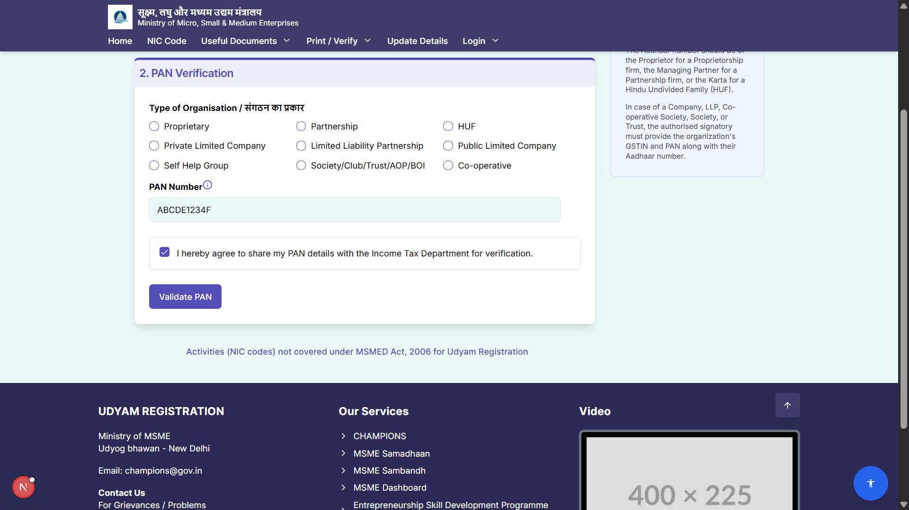
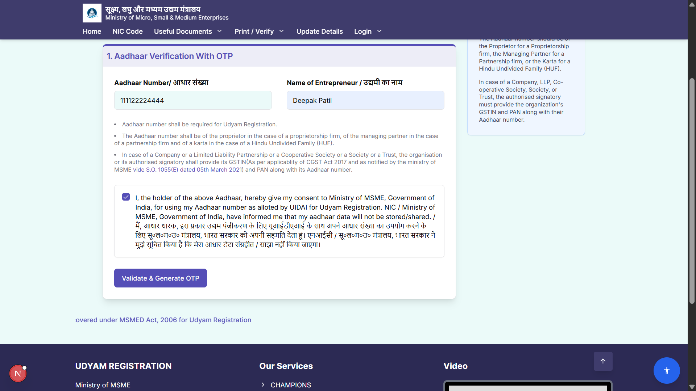
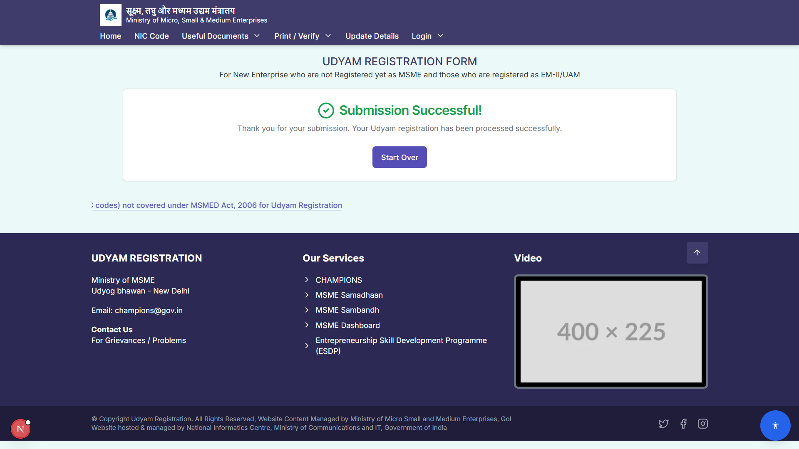

# Udyam Assist - Registration Form Clone

A high-fidelity, responsive clone of the first two steps of the Udyam MSME registration portal, built with a modern tech stack. This project showcases dynamic form handling, real-time validation, and seamless backend integration using Next.js Server Actions and Supabase.

## 📋 Table of Contents

- [Udyam Assist - Registration Form Clone](#udyam-assist---registration-form-clone)
  - [📋 Table of Contents](#-table-of-contents)
  - [🚀 Live Demo](#-live-demo)
  - [✨ Features](#-features)
  - [🛠️ Tech Stack](#️-tech-stack)
  - [🏁 Getting Started](#-getting-started)
  - [☁️ Deployment](#️-deployment)
    - [Vercel (Recommended)](#vercel-recommended)
  - [📸 Screenshots](#-screenshots)

---

## 🚀 Live Demo

[**View the deployed application here!**](https://udyam-assist.vercel.app/)

_Note: Replace the placeholder link above with your actual Vercel deployment URL._

---

## ✨ Features

- **Responsive Multi-Step Form:** A pixel-perfect UI that works flawlessly on desktop and mobile devices.
- **Dynamic Form Rendering:** Form steps and fields are dynamically generated from a central schema.
- **Real-Time Validation:** Instant user feedback for fields like Aadhaar and PAN, powered by Zod.
- **PIN Code Auto-fill:** Automatically populates State and City fields using an external API, improving user experience.
- **Visual Progress Tracker:** Guides the user through the registration steps.
- **Full-Stack Integration:** Uses Next.js Server Actions for secure backend logic and data submission.
- **Database Integration:** Securely stores all successful submissions in a PostgreSQL database via Supabase.
- **Unit Tested:** Core validation logic and server actions are covered by unit tests using Jest.


_Preview of the PAN verification step_

---

## 🛠️ Tech Stack

- **Framework:** [Next.js](https://nextjs.org/) (React)
- **Language:** [TypeScript](https://www.typescriptlang.org/)
- **Styling:** [Tailwind CSS](https://tailwindcss.com/)
- **UI Components:** [ShadCN UI](https://ui.shadcn.com/)
- **Form Management:** [React Hook Form](https://react-hook-form.com/)
- **Validation:** [Zod](https://zod.dev/)
- **Database:** [Supabase](https://supabase.io/) (PostgreSQL)
- **Testing:** [Jest](https://jestjs.io/) & [React Testing Library](https://testing-library.com/)

---

## 🏁 Getting Started

To run this project locally, follow these steps:

1.  **Clone the repository:**

    ```bash
    git clone https://github.com/deepakpatil26/udyam-assist
    cd udyam-assist
    ```

2.  **Install dependencies:**

    ```bash
    npm install
    ```

3.  **Set up environment variables:**
    Create a file named `.env.local` in the root of the project and add your Supabase credentials:

    ```env
    NEXT_PUBLIC_SUPABASE_URL=YOUR_SUPABASE_URL
    NEXT_PUBLIC_SUPABASE_ANON_KEY=YOUR_SUPABASE_ANON_KEY
    ```

4.  **Run the development server:**
    ```bash
    npm run dev
    ```
    Open [http://localhost:9002](http://localhost:9002) in your browser to see the result.

---

## ☁️ Deployment

This is a full-stack Next.js application where the frontend and backend are deployed together as a single unit.

### Vercel (Recommended)

1.  Push the code to your GitHub repository.
2.  Go to [Vercel](https://vercel.com/) and create a new project, importing it from your GitHub repository.
3.  **Add Environment Variables:** In the project settings on Vercel, add the `NEXT_PUBLIC_SUPABASE_URL` and `NEXT_PUBLIC_SUPABASE_ANON_KEY` variables from your `.env.local` file.
4.  Click **Deploy**. Vercel will handle the rest!

---

## 📸 Screenshots

|             Step 1: Aadhaar Validation             |           Step 2: PAN Validation            |
| :------------------------------------------------: | :-----------------------------------------: |
|  |  |
|             **Submission Successful**              |
|   |
